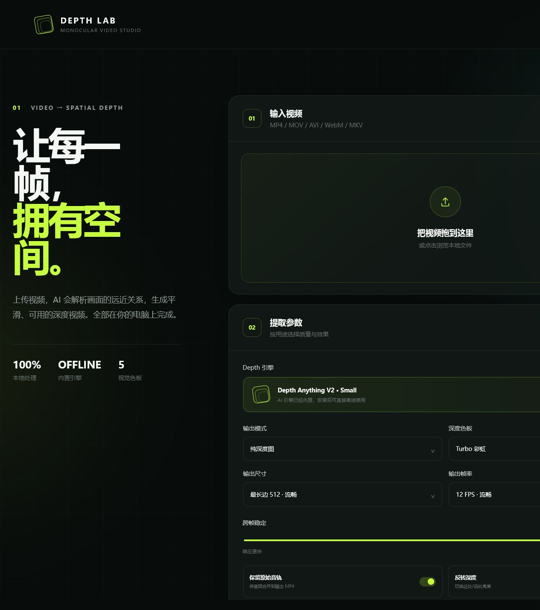

# Depth Lab

> 把普通视频转换为平滑、可预览、可导出的相对深度视频。

[](https://github.com/ying1459/DepthLab/releases/latest)
[](https://github.com/ying1459/DepthLab/actions/workflows/ci.yml)
[](LICENSE)
[](https://github.com/ying1459/DepthLab/releases/latest)

[English](README_EN.md) · [下载最新版](https://github.com/ying1459/DepthLab/releases/latest) · [提交问题](https://github.com/ying1459/DepthLab/issues)



Depth Lab 是一款本地运行的单目视频深度提取工具。它使用 Depth Anything V2 Small 逐帧估计相对深度，并输出标准 H.264 MP4。Windows 成品已内置 AI 模型和 FFmpeg，安装后即可离线使用，不需要 Python，也不需要另外下载权重。

## 主要功能

- 完全本地：视频和处理结果不会上传到云端
- 开箱即用：Windows 安装包内置模型与运行环境
- 界面流畅：AI 推理在独立进程运行，支持进度显示和立即取消
- 三种输出：纯深度图、原片叠加、左右对比
- 五种色板：Turbo、灰度、Inferno、Viridis、Magma
- 跨帧平滑：降低视频深度亮度闪烁
- 标准视频：输出 H.264 / yuv420p MP4，可直接预览和保存
- 音频保留：可将原视频音轨合并到输出文件

## 下载与使用

前往 [Releases](https://github.com/ying1459/DepthLab/releases/latest) 下载：

- `DepthLab-Setup-*-Windows-x64.exe`：安装版，推荐普通用户使用
- `DepthLab-Portable-*-Windows-x64.zip`：免安装版，解压后运行 `DepthLab.exe`

系统要求：Windows 10/11 x64。首次运行不需要下载模型。

1. 打开 Depth Lab。
2. 选择或拖入 MP4、MOV、AVI、WebM、MKV 视频。
3. 保持默认的“最长边 512 + 12 FPS”可获得较流畅的 CPU 处理速度。
4. 点击“开始提取 Depth”。
5. 完成后预览并保存 MP4。

## 从源码运行

需要 Python 3.10+，并能够访问 Hugging Face。源码仓库不提交 95 MB 的模型权重；首次处理时 Transformers 会自动获取 Small 模型。

```powershell
git clone https://github.com/ying1459/DepthLab.git
cd DepthLab
.\run.cmd
```

服务启动后访问 <http://127.0.0.1:8000>。

手动启动：

```powershell
py -m venv .venv
.\.venv\Scripts\Activate.ps1
python -m pip install -r requirements.txt
python -m uvicorn app.main:app --host 127.0.0.1 --port 8000
```

## 构建 Windows 成品

发布包需要先把模型下载到 `models/small/model.safetensors`。脚本会验证官方模型的 SHA-256。

```powershell
.\scripts\download_model.ps1
py -m venv .build-venv
.\.build-venv\Scripts\python.exe -m pip install -r requirements-build.txt
.\scripts\build_windows_release.ps1
```

该脚本会生成免安装 ZIP、安装包和 `SHA256SUMS.txt`。运行前还需要安装 [Inno Setup 6](https://jrsoftware.org/isinfo.php)。

## 测试

```powershell
python -m pip install -r requirements-ci.txt
pytest -q
```

## 说明与限制

- 输出是单目**相对深度**，不是以米为单位的精确测距数据。
- 不同镜头切换处可能出现相对尺度变化。
- CPU 处理速度取决于输入时长、尺寸和输出帧率；遇到慢速设备时建议保留默认流畅参数。

## 开源许可

应用源码采用 [MIT License](LICENSE)。随 Windows 成品分发的 Depth Anything V2 Small 模型采用 Apache-2.0，详见 [第三方声明](THIRD_PARTY_NOTICES.md) 和 [Apache-2.0 协议全文](LICENSES/Apache-2.0.txt)。

欢迎提交 [Issue](https://github.com/ying1459/DepthLab/issues) 和 Pull Request。贡献前请阅读 [CONTRIBUTING.md](CONTRIBUTING.md)。
